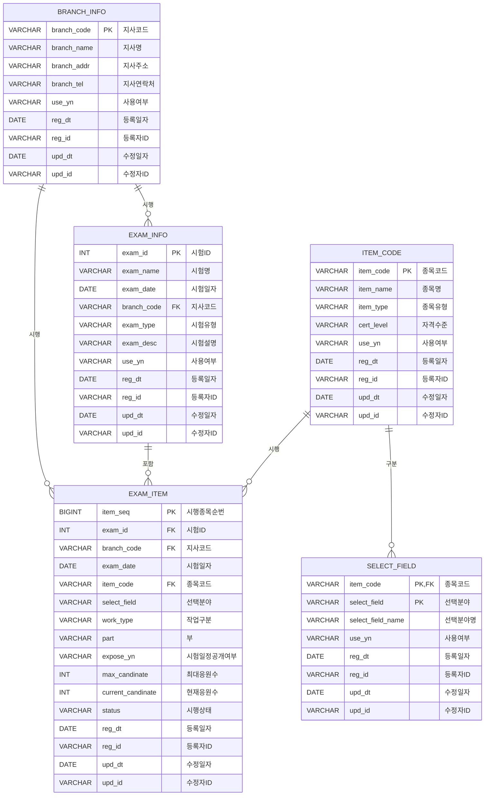

# DB 테이블 설계서 - 지사별 시행종목 조회

## 1. 문서 정보

| 항목 | 내용 |
|:---|:---|
| **프로젝트명** | [시스템명] - 시험관리 모듈 |
| **문서명** | DB 테이블 설계서 - 지사별 시행종목 조회 |
| **버전** | 1.0 |
| **작성일** | 2026-05-19 |
| **작성자** | [이름/팀명] |
| **검토자** | [이름/역할] |

## 2. 변경 이력

| 버전 | 작성일 | 작성자 | 변경 내용 요약 |
|:---|:---|:---|:---|
| 1.0 | 2026-05-19 | [이름] | 초안 작성 |

## 3. 용어 정의

| 용어 | 정의 | 비고 |
|:---|:---|:---|
| 시험정보 | 시험 회차, 시험명, 시험 유형 등을 포함하는 기본 시험 메타 정보 | |
| 지사 | 시험을 시행하는 지역별 운영 단위 조직 | |
| 시행종목 | 특정 지사에서 특정 시험일자에 시행되는 자격 종목 | |
| 종목코드 | 자격 종목을 식별하는 고유 코드 | |
| 선택분야 | 종목 내 세부 선택 가능한 분야 구분 코드 | |
| 작업구분 | 시행종목의 작업 유형 구분 (예: 실기, 필기 등) | |
| 부 | 시험 시행 회차 내 세부 시간 단위 구분 | |
| 시험일정공개여부 | 해당 종목의 시험 일정 정보가 응시자에게 공개되었는지 여부 | Y/N |

## 4. ERD (Entity Relationship Diagram)



> **※ 참고:**
> - PK: Primary Key (기본키)
> - FK: Foreign Key (외래키)
> - 모든 테이블은 공통 관리 컬럼(`reg_dt`, `reg_id`, `upd_dt`, `upd_id`)을 포함합니다.

## 5. 테이블 목록

| 순번 | 테이블명 | 테이블명(한글) | 테이블 설명 |
|:---:|:---|:---|:---|
| 1 | `BRANCH_INFO` | 지사정보 | 시험을 시행하는 지역별 운영 단위 조직 정보를 저장하는 테이블 |
| 2 | `EXAM_INFO` | 시험정보 | 시험 회차, 시험명, 시험 유형 등을 포함하는 기본 시험 메타 정보를 저장하는 테이블 |
| 3 | `ITEM_CODE` | 종목코드 | 자격 종목을 식별하는 고유 코드 및 종목 기본 정보를 저장하는 테이블 |
| 4 | `SELECT_FIELD` | 선택분야 | 종목 내 세부 선택 가능한 분야 구분 정보를 저장하는 테이블 |
| 5 | `EXAM_ITEM` | 시행종목 | 특정 지사에서 특정 시험일자에 시행되는 자격 종목 정보를 저장하는 테이블 |

---

## 6. 테이블 정의서

### 테이블 1. BRANCH_INFO (지사정보)

| 항목 | 내용 |
|:---|:---|
| **테이블명** | `BRANCH_INFO` |
| **테이블명(한글)** | 지사정보 |
| **테이블설명** | 시험을 시행하는 지역별 운영 단위 조직 정보를 저장하는 테이블 |
| **저장매체** | Tablespace: `TS_DATA` |

#### 컬럼 정의

| 순번 | 컬럼명 | 컬럼명(한글) | 데이터형 | 길이 | Null | 기본값 | 기본키 | 외래키 | 인덱스 | 컬럼설명 |
|:---:|:---|:---|:---|:---:|:---:|:---:|:---:|:---:|:---:|:---|
| 1 | `BRANCH_CODE` | 지사코드 | `VARCHAR2` | 10 | N | - | **PK** | | | 지사 정보를 식별하는 고유 코드 |
| 2 | `BRANCH_NAME` | 지사명 | `VARCHAR2` | 100 | N | - | | | **UQ** | 지사 이름 |
| 3 | `BRANCH_ADDR` | 지사주소 | `VARCHAR2` | 200 | Y | null | | | | 지사 주소 |
| 4 | `BRANCH_TEL` | 지사연락처 | `VARCHAR2` | 20 | Y | null | | | | 지사 전화번호 |
| 5 | `USE_YN` | 사용여부 | `VARCHAR2` | 1 | N | 'Y' | | | | 사용 여부 (Y: 사용, N: 사용안함) |
| 6 | `REG_DT` | 등록일자 | `DATE` | - | N | SYSDATE | | | | 데이터 등록일자 |
| 7 | `REG_ID` | 등록자ID | `VARCHAR2` | 50 | N | - | | | | 데이터 등록자 ID |
| 8 | `UPD_DT` | 수정일자 | `DATE` | - | N | SYSDATE | | | | 데이터 최종수정일자 |
| 9 | `UPD_ID` | 수정자ID | `VARCHAR2` | 50 | N | - | | | | 데이터 최종수정자 ID |

#### 인덱스 정의

| 인덱스명 | 인덱스유형 | 인덱스컬럼 | 비고 |
|:---|:---|:---|:---|
| `PK_INDEX_BRANCH_INFO_BRANCH_CODE` | PK | `BRANCH_CODE` | 기본키 인덱스 |
| `UQ_INDEX_BRANCH_INFO_BRANCH_NAME` | UNIQUE | `BRANCH_NAME` | 고유 인덱스 |

---

### 테이블 2. EXAM_INFO (시험정보)

| 항목 | 내용 |
|:---|:---|
| **테이블명** | `EXAM_INFO` |
| **테이블명(한글)** | 시험정보 |
| **테이블설명** | 시험 회차, 시험명, 시험 유형 등을 포함하는 기본 시험 메타 정보를 저장하는 테이블 |
| **저장매체** | Tablespace: `TS_DATA` |

#### 컬럼 정의

| 순번 | 컬럼명 | 컬럼명(한글) | 데이터형 | 길이 | Null | 기본값 | 기본키 | 외래키 | 인덱스 | 컬럼설명 |
|:---:|:---|:---|:---|:---:|:---:|:---:|:---:|:---:|:---:|:---|
| 1 | `EXAM_ID` | 시험ID | `NUMBER` | 10 | N | - | **PK** | | | 시험 정보를 식별하는 고유 ID (SEQ_EXAM_ID 연동) |
| 2 | `EXAM_NAME` | 시험명 | `VARCHAR2` | 200 | N | - | | | **UQ** | 시험 이름 |
| 3 | `EXAM_DATE` | 시험일자 | `DATE` | - | N | - | | | **IDX** | 시험 시행 일자 |
| 4 | `BRANCH_CODE` | 지사코드 | `VARCHAR2` | 10 | N | - | | **FK** | **IDX** | 시험을 시행하는 지사 코드 (BRANCH_INFO 참조) |
| 5 | `EXAM_TYPE` | 시험유형 | `VARCHAR2` | 20 | Y | null | | | | 시험 유형 (예: 필기, 실기, 통합 등) |
| 6 | `EXAM_DESC` | 시험설명 | `VARCHAR2` | 500 | Y | null | | | | 시험 상세 설명 |
| 7 | `USE_YN` | 사용여부 | `VARCHAR2` | 1 | N | 'Y' | | | | 사용 여부 (Y: 사용, N: 사용안함) |
| 8 | `REG_DT` | 등록일자 | `DATE` | - | N | SYSDATE | | | | 데이터 등록일자 |
| 9 | `REG_ID` | 등록자ID | `VARCHAR2` | 50 | N | - | | | | 데이터 등록자 ID |
| 10 | `UPD_DT` | 수정일자 | `DATE` | - | N | SYSDATE | | | | 데이터 최종수정일자 |
| 11 | `UPD_ID` | 수정자ID | `VARCHAR2` | 50 | N | - | | | | 데이터 최종수정자 ID |

#### 시퀀스 정의

| 시퀀스명 | START | INCREMENT | 비고 |
|:---|:---:|:---:|:---|
| `SEQ_EXAM_ID` | 1 | 1 | EXAM_ID 자동 생성 |

#### 인덱스 정의

| 인덱스명 | 인덱스유형 | 인덱스컬럼 | 비고 |
|:---|:---|:---|:---|
| `PK_INDEX_EXAM_INFO_EXAM_ID` | PK | `EXAM_ID` | 기본키 인덱스 |
| `UQ_INDEX_EXAM_INFO_EXAM_NAME` | UNIQUE | `EXAM_NAME` | 고유 인덱스 |
| `IDX_INDEX_EXAM_INFO_EXAM_DATE` | INDEX | `EXAM_DATE` | 조회 성능 향상 |
| `IDX_INDEX_EXAM_INFO_BRANCH_CODE` | INDEX | `BRANCH_CODE` | FK 인덱스 |

---

### 테이블 3. ITEM_CODE (종목코드)

| 항목 | 내용 |
|:---|:---|
| **테이블명** | `ITEM_CODE` |
| **테이블명(한글)** | 종목코드 |
| **테이블설명** | 자격 종목을 식별하는 고유 코드 및 종목 기본 정보를 저장하는 테이블 |
| **저장매체** | Tablespace: `TS_DATA` |

#### 컬럼 정의

| 순번 | 컬럼명 | 컬럼명(한글) | 데이터형 | 길이 | Null | 기본값 | 기본키 | 외래키 | 인덱스 | 컬럼설명 |
|:---:|:---|:---|:---|:---:|:---:|:---:|:---:|:---:|:---:|:---|
| 1 | `ITEM_CODE` | 종목코드 | `VARCHAR2` | 20 | N | - | **PK** | | | 자격 종목을 식별하는 고유 코드 |
| 2 | `ITEM_NAME` | 종목명 | `VARCHAR2` | 100 | N | - | | | **UQ** | 자격 종목 이름 |
| 3 | `ITEM_TYPE` | 종목유형 | `VARCHAR2` | 20 | Y | null | | | | 종목 유형 (예: 산업기사, 기능사, 기사 등) |
| 4 | `CERT_LEVEL` | 자격수준 | `VARCHAR2` | 20 | Y | null | | | | 자격 수준 등급 |
| 5 | `USE_YN` | 사용여부 | `VARCHAR2` | 1 | N | 'Y' | | | | 사용 여부 (Y: 사용, N: 사용안함) |
| 6 | `REG_DT` | 등록일자 | `DATE` | - | N | SYSDATE | | | | 데이터 등록일자 |
| 7 | `REG_ID` | 등록자ID | `VARCHAR2` | 50 | N | - | | | | 데이터 등록자 ID |
| 8 | `UPD_DT` | 수정일자 | `DATE` | - | N | SYSDATE | | | | 데이터 최종수정일자 |
| 9 | `UPD_ID` | 수정자ID | `VARCHAR2` | 50 | N | - | | | | 데이터 최종수정자 ID |

#### 인덱스 정의

| 인덱스명 | 인덱스유형 | 인덱스컬럼 | 비고 |
|:---|:---|:---|:---|
| `PK_INDEX_ITEM_CODE_ITEM_CODE` | PK | `ITEM_CODE` | 기본키 인덱스 |
| `UQ_INDEX_ITEM_CODE_ITEM_NAME` | UNIQUE | `ITEM_NAME` | 고유 인덱스 |

---

### 테이블 4. SELECT_FIELD (선택분야)

| 항목 | 내용 |
|:---|:---|
| **테이블명** | `SELECT_FIELD` |
| **테이블명(한글)** | 선택분야 |
| **테이블설명** | 종목 내 세부 선택 가능한 분야 구분 정보를 저장하는 테이블 |
| **저장매체** | Tablespace: `TS_DATA` |

#### 컬럼 정의

| 순번 | 컬럼명 | 컬럼명(한글) | 데이터형 | 길이 | Null | 기본값 | 기본키 | 외래키 | 인덱스 | 컬럼설명 |
|:---:|:---|:---|:---|:---:|:---:|:---:|:---:|:---:|:---:|:---|
| 1 | `ITEM_CODE` | 종목코드 | `VARCHAR2` | 20 | N | - | **PK** | **FK** | | 종목 코드 (ITEM_CODE 참조) |
| 2 | `SELECT_FIELD` | 선택분야 | `VARCHAR2` | 20 | N | - | **PK** | | **UQ** | 종목 내 세부 선택 분야 코드 |
| 3 | `SELECT_FIELD_NAME` | 선택분야명 | `VARCHAR2` | 100 | N | - | | | | 선택 분야 이름 |
| 4 | `USE_YN` | 사용여부 | `VARCHAR2` | 1 | N | 'Y' | | | | 사용 여부 (Y: 사용, N: 사용안함) |
| 5 | `REG_DT` | 등록일자 | `DATE` | - | N | SYSDATE | | | | 데이터 등록일자 |
| 6 | `REG_ID` | 등록자ID | `VARCHAR2` | 50 | N | - | | | | 데이터 등록자 ID |
| 7 | `UPD_DT` | 수정일자 | `DATE` | - | N | SYSDATE | | | | 데이터 최종수정일자 |
| 8 | `UPD_ID` | 수정자ID | `VARCHAR2` | 50 | N | - | | | | 데이터 최종수정자 ID |

#### 복합 기본키 정의

| 인덱스명 | 인덱스유형 | 인덱스컬럼 | 비고 |
|:---|:---|:---|:---|
| `PK_INDEX_SELECT_FIELD` | PK | `ITEM_CODE` + `SELECT_FIELD` | 복합 기본키 인덱스 |

#### 인덱스 정의

| 인덱스명 | 인덱스유형 | 인덱스컬럼 | 비고 |
|:---|:---|:---|:---|
| `UQ_INDEX_SELECT_FIELD_ITEM_SELECT` | UNIQUE | `ITEM_CODE` + `SELECT_FIELD` | 고유 인덱스 |
| `FK_INDEX_SELECT_FIELD_ITEM_CODE` | INDEX | `ITEM_CODE` | FK 인덱스 |

---

### 테이블 5. EXAM_ITEM (시행종목)

| 항목 | 내용 |
|:---|:---|
| **테이블명** | `EXAM_ITEM` |
| **테이블명(한글)** | 시행종목 |
| **테이블설명** | 특정 지사에서 특정 시험일자에 시행되는 자격 종목 정보를 저장하는 테이블 |
| **저장매체** | Tablespace: `TS_DATA` |

#### 컬럼 정의

| 순번 | 컬럼명 | 컬럼명(한글) | 데이터형 | 길이 | Null | 기본값 | 기본키 | 외래키 | 인덱스 | 컬럼설명 |
|:---:|:---|:---|:---|:---:|:---:|:---:|:---:|:---:|:---:|:---|
| 1 | `ITEM_SEQ` | 시행종목순번 | `NUMBER` | 15 | N | - | **PK** | | | 시행종목 정보를 식별하는 고유 순번 (SEQ_EXAM_ITEM 연동) |
| 2 | `EXAM_ID` | 시험ID | `NUMBER` | 10 | N | - | | **FK** | **IDX** | 시험 정보 ID (EXAM_INFO 참조) |
| 3 | `BRANCH_CODE` | 지사코드 | `VARCHAR2` | 10 | N | - | | **FK** | **IDX** | 시험을 시행하는 지사 코드 (BRANCH_INFO 참조) |
| 4 | `EXAM_DATE` | 시험일자 | `DATE` | - | N | - | | | **IDX** | 시험 시행 일자 |
| 5 | `ITEM_CODE` | 종목코드 | `VARCHAR2` | 20 | N | - | | **FK** | **IDX** | 시행 종목 코드 (ITEM_CODE 참조) |
| 6 | `SELECT_FIELD` | 선택분야 | `VARCHAR2` | 20 | Y | null | | | | 종목 내 세부 선택 분야 코드 (SELECT_FIELD 참조) |
| 7 | `WORK_TYPE` | 작업구분 | `VARCHAR2` | 20 | Y | null | | | | 시행종목의 작업 유형 구분 (예: 실기, 필기, 면접 등) |
| 8 | `PART` | 부 | `VARCHAR2` | 10 | Y | null | | | | 시험 시행 회차 내 세부 시간 단위 구분 |
| 9 | `EXPOSE_YN` | 시험일정공개여부 | `VARCHAR2` | 1 | N | 'N' | | | | 시험 일정 공개 여부 (Y: 공개, N: 비공개) |
| 10 | `MAX_CANDINATE` | 최대응원수 | `NUMBER` | 10 | Y | null | | | | 해당 종목의 최대 응시 인원 수 |
| 11 | `CURRENT_CANDINATE` | 현재응원수 | `NUMBER` | 10 | N | 0 | | | | 해당 종목의 현재 응시 인원 수 |
| 12 | `STATUS` | 시행상태 | `VARCHAR2` | 20 | N | 'READY' | | | | 시행 상태 (READY: 대기, PROGRESS: 진행 중, COMPLETE: 완료, CANCEL: 취소) |
| 13 | `REG_DT` | 등록일자 | `DATE` | - | N | SYSDATE | | | | 데이터 등록일자 |
| 14 | `REG_ID` | 등록자ID | `VARCHAR2` | 50 | N | - | | | | 데이터 등록자 ID |
| 15 | `UPD_DT` | 수정일자 | `DATE` | - | N | SYSDATE | | | | 데이터 최종수정일자 |
| 16 | `UPD_ID` | 수정자ID | `VARCHAR2` | 50 | N | - | | | | 데이터 최종수정자 ID |

#### 시퀀스 정의

| 시퀀스명 | START | INCREMENT | 비고 |
|:---|:---:|:---:|:---|
| `SEQ_EXAM_ITEM` | 1 | 1 | ITEM_SEQ 자동 생성 |

#### 인덱스 정의

| 인덱스명 | 인덱스유형 | 인덱스컬럼 | 비고 |
|:---|:---|:---|:---|
| `PK_INDEX_EXAM_ITEM_ITEM_SEQ` | PK | `ITEM_SEQ` | 기본키 인덱스 |
| `IDX_INDEX_EXAM_ITEM_EXAM_ID` | INDEX | `EXAM_ID` | FK 인덱스 |
| `IDX_INDEX_EXAM_ITEM_BRANCH_CODE` | INDEX | `BRANCH_CODE` | FK 인덱스 |
| `IDX_INDEX_EXAM_ITEM_EXAM_DATE` | INDEX | `EXAM_DATE` | 조회 성능 향상 |
| `IDX_INDEX_EXAM_ITEM_ITEM_CODE` | INDEX | `ITEM_CODE` | FK 인덱스 |
| `IDX_INDEX_EXAM_ITEM_COMPOSITE` | INDEX | `ITEM_CODE` + `PART` | 정렬 기준 (REQ-003 규칙 6) |

#### 참조 무결성

| FK인덱스명 | 자식테이블 | 자식컬럼 | 부모테이블 | 부모컬럼 | 비고 |
|:---|:---|:---|:---|:---|:---|
| `FK_EXAM_ITEM_SELECT_FIELD` | EXAM_ITEM | SELECT_FIELD | SELECT_FIELD | SELECT_FIELD | 복합 FK (ITEM_CODE + SELECT_FIELD) 참조 |

---

## 7. 공통 관리 컬럼 정의

모든 테이블은 다음 공통 관리 컬럼을 필수로 포함합니다.

| 순번 | 컬럼명 | 컬럼명(한글) | 데이터형 | 길이 | Null | 기본값 | 컬럼설명 |
|:---:|:---|:---|:---|:---:|:---:|:---:|:---|
| 1 | `REG_DT` | 등록일자 | `DATE` | - | N | SYSDATE | 데이터 등록일자 (시스템 자동 입력) |
| 2 | `REG_ID` | 등록자ID | `VARCHAR2` | 50 | N | - | 데이터 등록자 ID (로그인한 사용자 ID) |
| 3 | `UPD_DT` | 수정일자 | `DATE` | - | N | SYSDATE | 데이터 최종수정일자 (시스템 자동 입력) |
| 4 | `UPD_ID` | 수정자ID | `VARCHAR2` | 50 | N | - | 데이터 최종수정자 ID (로그인한 사용자 ID) |

---

## 8. 인덱스 정의서 (전체)

| 순번 | 인덱스명 | 인덱스유형 | 테이블명 | 인덱스컬럼 | 비고 |
|:---:|:---|:---|:---|:---|:---|
| 1 | `PK_INDEX_BRANCH_INFO_BRANCH_CODE` | PK | BRANCH_INFO | `BRANCH_CODE` | 기본키 인덱스 |
| 2 | `UQ_INDEX_BRANCH_INFO_BRANCH_NAME` | UNIQUE | BRANCH_INFO | `BRANCH_NAME` | 고유 인덱스 |
| 3 | `PK_INDEX_EXAM_INFO_EXAM_ID` | PK | EXAM_INFO | `EXAM_ID` | 기본키 인덱스 |
| 4 | `UQ_INDEX_EXAM_INFO_EXAM_NAME` | UNIQUE | EXAM_INFO | `EXAM_NAME` | 고유 인덱스 |
| 5 | `IDX_INDEX_EXAM_INFO_EXAM_DATE` | INDEX | EXAM_INFO | `EXAM_DATE` | 조회 성능 향상 |
| 6 | `IDX_INDEX_EXAM_INFO_BRANCH_CODE` | INDEX | EXAM_INFO | `BRANCH_CODE` | FK 인덱스 |
| 7 | `PK_INDEX_ITEM_CODE_ITEM_CODE` | PK | ITEM_CODE | `ITEM_CODE` | 기본키 인덱스 |
| 8 | `UQ_INDEX_ITEM_CODE_ITEM_NAME` | UNIQUE | ITEM_CODE | `ITEM_NAME` | 고유 인덱스 |
| 9 | `PK_INDEX_SELECT_FIELD` | PK | SELECT_FIELD | `ITEM_CODE`, `SELECT_FIELD` | 복합 기본키 인덱스 |
| 10 | `FK_INDEX_SELECT_FIELD_ITEM_CODE` | INDEX | SELECT_FIELD | `ITEM_CODE` | FK 인덱스 |
| 11 | `PK_INDEX_EXAM_ITEM_ITEM_SEQ` | PK | EXAM_ITEM | `ITEM_SEQ` | 기본키 인덱스 |
| 12 | `IDX_INDEX_EXAM_ITEM_EXAM_ID` | INDEX | EXAM_ITEM | `EXAM_ID` | FK 인덱스 |
| 13 | `IDX_INDEX_EXAM_ITEM_BRANCH_CODE` | INDEX | EXAM_ITEM | `BRANCH_CODE` | FK 인덱스 |
| 14 | `IDX_INDEX_EXAM_ITEM_EXAM_DATE` | INDEX | EXAM_ITEM | `EXAM_DATE` | 조회 성능 향상 |
| 15 | `IDX_INDEX_EXAM_ITEM_ITEM_CODE` | INDEX | EXAM_ITEM | `ITEM_CODE` | FK 인덱스 |
| 16 | `IDX_INDEX_EXAM_ITEM_COMPOSITE` | INDEX | EXAM_ITEM | `ITEM_CODE`, `PART` | 정렬 기준 (REQ-003 규칙 6) |

---

## 9. 시퀀스 정의서 (전체)

| 순번 | 시퀀스명 | 사용테이블 | 사용컬럼 | START | INCREMENT | 비고 |
|:---:|:---|:---|:---|:---:|:---:|:---|
| 1 | `SEQ_EXAM_ID` | EXAM_INFO | `EXAM_ID` | 1 | 1 | 시험ID 자동 생성 |
| 2 | `SEQ_EXAM_ITEM` | EXAM_ITEM | `ITEM_SEQ` | 1 | 1 | 시행종목순번 자동 생성 |

---

## 10. 참조 무결성 정의 (전체)

| 순번 | FK인덱스명 | 자식테이블 | 자식컬럼 | 부모테이블 | 부모컬럼 | 삭제정책 |
|:---:|:---|:---|:---|:---|:---|:---|
| 1 | `FK_EXAM_INFO_BRANCH_CODE` | EXAM_INFO | `BRANCH_CODE` | BRANCH_INFO | `BRANCH_CODE` | RESTRICT |
| 2 | `FK_EXAM_ITEM_EXAM_ID` | EXAM_ITEM | `EXAM_ID` | EXAM_INFO | `EXAM_ID` | RESTRICT |
| 3 | `FK_EXAM_ITEM_BRANCH_CODE` | EXAM_ITEM | `BRANCH_CODE` | BRANCH_INFO | `BRANCH_CODE` | RESTRICT |
| 4 | `FK_EXAM_ITEM_ITEM_CODE` | EXAM_ITEM | `ITEM_CODE` | ITEM_CODE | `ITEM_CODE` | RESTRICT |
| 5 | `FK_EXAM_ITEM_SELECT_FIELD` | EXAM_ITEM | `SELECT_FIELD` | SELECT_FIELD | `SELECT_FIELD` | RESTRICT |
| 6 | `FK_SELECT_FIELD_ITEM_CODE` | SELECT_FIELD | `ITEM_CODE` | ITEM_CODE | `ITEM_CODE` | RESTRICT |

---

## 11. 설계 참고사항

### 데이터 타입 기준
- Oracle Database 기준 설계하였으며, 필요 시 MySQL 등 다른 DBMS에 맞게 데이터형을 조정하십시오.
- `VARCHAR2` → MySQL 사용 시 `VARCHAR`로 변경 권장
- `NUMBER` → MySQL 사용 시 `INT`, `BIGINT` 등으로 변경 권장

### 공통 관리 컬럼
- 모든 테이블은 등록일자(`REG_DT`), 등록자ID(`REG_ID`), 수정일자(`UPD_DT`), 수정자ID(`UPD_ID`) 컬럼을 필수로 포함합니다.
- `REG_DT`, `UPD_DT`: `SYSDATE` 기본값 적용
- `REG_ID`, `UPD_ID`: 로그인한 사용자 ID 시스템에서 자동 입력

### 코드 테이블
- `USE_YN`, `EXPOSE_YN`, `STATUS`, `WORK_TYPE`, `PART`, `EXAM_TYPE` 등의 코드 값은 별도 코드 관리 테이블에서 관리하는 것을 권장합니다.
- 향후 코드 값 추가/수정 시 테이블 수정 없이 코드 테이블만 관리하면 됩니다.

### 요구사항 매핑

| 요구사항 | 관련 테이블 | 비고 |
|:---|:---|:---|
| REQ-001 (시험정보 선택) | `EXAM_INFO`, `BRANCH_INFO` | 지사별 시험정보 조회 |
| REQ-002 (조회 조건 설정) | `EXAM_INFO`, `BRANCH_INFO` | 시험일자 자동 세팅 |
| REQ-003 (시행종목 목록 조회) | `EXAM_ITEM`, `EXAM_INFO`, `BRANCH_INFO`, `ITEM_CODE`, `SELECT_FIELD` | 5개 테이블 조인 |
| REQ-004 (엑셀 다운로드) | REQ-003 조회 결과 기반 | 다운로드 파일명: `지사별시행종목_[지사명]_[시험명]_[시험일자]_[다운로드일시].xlsx` |

### 정렬 기준 (REQ-003 규칙 6)
- 기본 정렬: `ITEM_CODE` 오름차순 → `PART` 오름차순
- 인덱스: `IDX_INDEX_EXAM_ITEM_COMPOSITE` (`ITEM_CODE`, `PART`)

### 페이지네이션 (REQ-003 규칙 5)
- 페이지당 표시 건수: 20건
- 전체 건수 및 현재 페이지 정보 함께 표시

---

## 12. 생성 SQL 예시 (Oracle)

```sql
-- 지사정보 테이블 생성
CREATE TABLE BRANCH_INFO (
    BRANCH_CODE     VARCHAR2(10)    NOT NULL,
    BRANCH_NAME     VARCHAR2(100)   NOT NULL,
    BRANCH_ADDR     VARCHAR2(200)   NULL,
    BRANCH_TEL      VARCHAR2(20)    NULL,
    USE_YN          VARCHAR2(1)     NOT NULL DEFAULT 'Y',
    REG_DT          DATE            NOT NULL DEFAULT SYSDATE,
    REG_ID          VARCHAR2(50)    NOT NULL,
    UPD_DT          DATE            NOT NULL DEFAULT SYSDATE,
    UPD_ID          VARCHAR2(50)    NOT NULL,
    CONSTRAINT PK_BRANCH_INFO PRIMARY KEY (BRANCH_CODE)
);

COMMENT ON TABLE BRANCH_INFO IS '지사정보';
COMMENT ON COLUMN BRANCH_INFO.BRANCH_CODE IS '지사코드';
COMMENT ON COLUMN BRANCH_INFO.BRANCH_NAME IS '지사명';
COMMENT ON COLUMN BRANCH_INFO.BRANCH_ADDR IS '지사주소';
COMMENT ON COLUMN BRANCH_INFO.BRANCH_TEL IS '지사연락처';
COMMENT ON COLUMN BRANCH_INFO.USE_YN IS '사용여부 (Y: 사용, N: 사용안함)';
COMMENT ON COLUMN BRANCH_INFO.REG_DT IS '데이터 등록일자';
COMMENT ON COLUMN BRANCH_INFO.REG_ID IS '데이터 등록자 ID';
COMMENT ON COLUMN BRANCH_INFO.UPD_DT IS '데이터 최종수정일자';
COMMENT ON COLUMN BRANCH_INFO.UPD_ID IS '데이터 최종수정자 ID';

CREATE UNIQUE INDEX UQ_BRANCH_INFO_NAME ON BRANCH_INFO(BRANCH_NAME);

-- 시험정보 테이블 생성
CREATE TABLE EXAM_INFO (
    EXAM_ID         NUMBER(10)      NOT NULL,
    EXAM_NAME       VARCHAR2(200)   NOT NULL,
    EXAM_DATE       DATE            NOT NULL,
    BRANCH_CODE     VARCHAR2(10)    NOT NULL,
    EXAM_TYPE       VARCHAR2(20)    NULL,
    EXAM_DESC       VARCHAR2(500)   NULL,
    USE_YN          VARCHAR2(1)     NOT NULL DEFAULT 'Y',
    REG_DT          DATE            NOT NULL DEFAULT SYSDATE,
    REG_ID          VARCHAR2(50)    NOT NULL,
    UPD_DT          DATE            NOT NULL DEFAULT SYSDATE,
    UPD_ID          VARCHAR2(50)    NOT NULL,
    CONSTRAINT PK_EXAM_INFO PRIMARY KEY (EXAM_ID),
    CONSTRAINT FK_EXAM_INFO_BRANCH FOREIGN KEY (BRANCH_CODE)
        REFERENCES BRANCH_INFO(BRANCH_CODE)
);

COMMENT ON TABLE EXAM_INFO IS '시험정보';
COMMENT ON COLUMN EXAM_INFO.EXAM_ID IS '시험ID';
COMMENT ON COLUMN EXAM_INFO.EXAM_NAME IS '시험명';
COMMENT ON COLUMN EXAM_INFO.EXAM_DATE IS '시험시행일자';
COMMENT ON COLUMN EXAM_INFO.BRANCH_CODE IS '지사코드';
COMMENT ON COLUMN EXAM_INFO.EXAM_TYPE IS '시험유형';
COMMENT ON COLUMN EXAM_INFO.EXAM_DESC IS '시험설명';
COMMENT ON COLUMN EXAM_INFO.USE_YN IS '사용여부 (Y: 사용, N: 사용안함)';
COMMENT ON COLUMN EXAM_INFO.REG_DT IS '데이터 등록일자';
COMMENT ON COLUMN EXAM_INFO.REG_ID IS '데이터 등록자 ID';
COMMENT ON COLUMN EXAM_INFO.UPD_DT IS '데이터 최종수정일자';
COMMENT ON COLUMN EXAM_INFO.UPD_ID IS '데이터 최종수정자 ID';

CREATE UNIQUE INDEX UQ_EXAM_INFO_NAME ON EXAM_INFO(EXAM_NAME);
CREATE INDEX IDX_EXAM_INFO_DATE ON EXAM_INFO(EXAM_DATE);
CREATE INDEX IDX_EXAM_INFO_BRANCH ON EXAM_INFO(BRANCH_CODE);

-- 종목코드 테이블 생성
CREATE TABLE ITEM_CODE (
    ITEM_CODE       VARCHAR2(20)    NOT NULL,
    ITEM_NAME       VARCHAR2(100)   NOT NULL,
    ITEM_TYPE       VARCHAR2(20)    NULL,
    CERT_LEVEL      VARCHAR2(20)    NULL,
    USE_YN          VARCHAR2(1)     NOT NULL DEFAULT 'Y',
    REG_DT          DATE            NOT NULL DEFAULT SYSDATE,
    REG_ID          VARCHAR2(50)    NOT NULL,
    UPD_DT          DATE            NOT NULL DEFAULT SYSDATE,
    UPD_ID          VARCHAR2(50)    NOT NULL,
    CONSTRAINT PK_ITEM_CODE PRIMARY KEY (ITEM_CODE)
);

COMMENT ON TABLE ITEM_CODE IS '종목코드';
COMMENT ON COLUMN ITEM_CODE.ITEM_CODE IS '종목코드';
COMMENT ON COLUMN ITEM_CODE.ITEM_NAME IS '종목명';
COMMENT ON COLUMN ITEM_CODE.ITEM_TYPE IS '종목유형';
COMMENT ON COLUMN ITEM_CODE.CERT_LEVEL IS '자격수준';
COMMENT ON COLUMN ITEM_CODE.USE_YN IS '사용여부 (Y: 사용, N: 사용안함)';
COMMENT ON COLUMN ITEM_CODE.REG_DT IS '데이터 등록일자';
COMMENT ON COLUMN ITEM_CODE.REG_ID IS '데이터 등록자 ID';
COMMENT ON COLUMN ITEM_CODE.UPD_DT IS '데이터 최종수정일자';
COMMENT ON COLUMN ITEM_CODE.UPD_ID IS '데이터 최종수정자 ID';

CREATE UNIQUE INDEX UQ_ITEM_CODE_NAME ON ITEM_CODE(ITEM_NAME);

-- 선택분야 테이블 생성
CREATE TABLE SELECT_FIELD (
    ITEM_CODE       VARCHAR2(20)    NOT NULL,
    SELECT_FIELD    VARCHAR2(20)    NOT NULL,
    SELECT_FIELD_NAME VARCHAR2(100) NOT NULL,
    USE_YN          VARCHAR2(1)     NOT NULL DEFAULT 'Y',
    REG_DT          DATE            NOT NULL DEFAULT SYSDATE,
    REG_ID          VARCHAR2(50)    NOT NULL,
    UPD_DT          DATE            NOT NULL DEFAULT SYSDATE,
    UPD_ID          VARCHAR2(50)    NOT NULL,
    CONSTRAINT PK_SELECT_FIELD PRIMARY KEY (ITEM_CODE, SELECT_FIELD),
    CONSTRAINT FK_SELECT_FIELD_ITEM FOREIGN KEY (ITEM_CODE)
        REFERENCES ITEM_CODE(ITEM_CODE)
);

COMMENT ON TABLE SELECT_FIELD IS '선택분야';
COMMENT ON COLUMN SELECT_FIELD.ITEM_CODE IS '종목코드';
COMMENT ON COLUMN SELECT_FIELD.SELECT_FIELD IS '선택분야';
COMMENT ON COLUMN SELECT_FIELD.SELECT_FIELD_NAME IS '선택분야명';
COMMENT ON COLUMN SELECT_FIELD.USE_YN IS '사용여부 (Y: 사용, N: 사용안함)';
COMMENT ON COLUMN SELECT_FIELD.REG_DT IS '데이터 등록일자';
COMMENT ON COLUMN SELECT_FIELD.REG_ID IS '데이터 등록자 ID';
COMMENT ON COLUMN SELECT_FIELD.UPD_DT IS '데이터 최종수정일자';
COMMENT ON COLUMN SELECT_FIELD.UPD_ID IS '데이터 최종수정자 ID';

CREATE UNIQUE INDEX UQ_SELECT_FIELD_ITEM ON SELECT_FIELD(ITEM_CODE, SELECT_FIELD);
CREATE INDEX IDX_SELECT_FIELD_ITEM ON SELECT_FIELD(ITEM_CODE);

-- 시행종목 테이블 생성
CREATE TABLE EXAM_ITEM (
    ITEM_SEQ            NUMBER(15)      NOT NULL,
    EXAM_ID             NUMBER(10)      NOT NULL,
    BRANCH_CODE         VARCHAR2(10)    NOT NULL,
    EXAM_DATE           DATE            NOT NULL,
    ITEM_CODE           VARCHAR2(20)    NOT NULL,
    SELECT_FIELD        VARCHAR2(20)    NULL,
    WORK_TYPE           VARCHAR2(20)    NULL,
    PART                VARCHAR2(10)    NULL,
    EXPOSE_YN           VARCHAR2(1)     NOT NULL DEFAULT 'N',
    MAX_CANDINATE       NUMBER(10)      NULL,
    CURRENT_CANDINATE   NUMBER(10)      NOT NULL DEFAULT 0,
    STATUS              VARCHAR2(20)    NOT NULL DEFAULT 'READY',
    REG_DT              DATE            NOT NULL DEFAULT SYSDATE,
    REG_ID              VARCHAR2(50)    NOT NULL,
    UPD_DT              DATE            NOT NULL DEFAULT SYSDATE,
    UPD_ID              VARCHAR2(50)    NOT NULL,
    CONSTRAINT PK_EXAM_ITEM PRIMARY KEY (ITEM_SEQ),
    CONSTRAINT FK_EXAM_ITEM_EXAM FOREIGN KEY (EXAM_ID)
        REFERENCES EXAM_INFO(EXAM_ID),
    CONSTRAINT FK_EXAM_ITEM_BRANCH FOREIGN KEY (BRANCH_CODE)
        REFERENCES BRANCH_INFO(BRANCH_CODE),
    CONSTRAINT FK_EXAM_ITEM_ITEM FOREIGN KEY (ITEM_CODE)
        REFERENCES ITEM_CODE(ITEM_CODE),
    CONSTRAINT FK_EXAM_ITEM_SELECT FOREIGN KEY (ITEM_CODE, SELECT_FIELD)
        REFERENCES SELECT_FIELD(ITEM_CODE, SELECT_FIELD)
);

COMMENT ON TABLE EXAM_ITEM IS '시행종목';
COMMENT ON COLUMN EXAM_ITEM.ITEM_SEQ IS '시행종목순번';
COMMENT ON COLUMN EXAM_ITEM.EXAM_ID IS '시험ID';
COMMENT ON COLUMN EXAM_ITEM.BRANCH_CODE IS '지사코드';
COMMENT ON COLUMN EXAM_ITEM.EXAM_DATE IS '시험시행일자';
COMMENT ON COLUMN EXAM_ITEM.ITEM_CODE IS '종목코드';
COMMENT ON COLUMN EXAM_ITEM.SELECT_FIELD IS '선택분야';
COMMENT ON COLUMN EXAM_ITEM.WORK_TYPE IS '작업구분';
COMMENT ON COLUMN EXAM_ITEM.PART IS '부';
COMMENT ON COLUMN EXAM_ITEM.EXPOSE_YN IS '시험일정공개여부 (Y: 공개, N: 비공개)';
COMMENT ON COLUMN EXAM_ITEM.MAX_CANDINATE IS '최대응원수';
COMMENT ON COLUMN EXAM_ITEM.CURRENT_CANDINATE IS '현재응원수';
COMMENT ON COLUMN EXAM_ITEM.STATUS IS '시행상태 (READY:대기, PROGRESS:진행중, COMPLETE:완료, CANCEL:취소)';
COMMENT ON COLUMN EXAM_ITEM.REG_DT IS '데이터 등록일자';
COMMENT ON COLUMN EXAM_ITEM.REG_ID IS '데이터 등록자 ID';
COMMENT ON COLUMN EXAM_ITEM.UPD_DT IS '데이터 최종수정일자';
COMMENT ON COLUMN EXAM_ITEM.UPD_ID IS '데이터 최종수정자 ID';

CREATE INDEX IDX_EXAM_ITEM_EXAM ON EXAM_ITEM(EXAM_ID);
CREATE INDEX IDX_EXAM_ITEM_BRANCH ON EXAM_ITEM(BRANCH_CODE);
CREATE INDEX IDX_EXAM_ITEM_DATE ON EXAM_ITEM(EXAM_DATE);
CREATE INDEX IDX_EXAM_ITEM_ITEM ON EXAM_ITEM(ITEM_CODE);
CREATE INDEX IDX_EXAM_ITEM_COMPOSITE ON EXAM_ITEM(ITEM_CODE, PART);

-- 시퀀스 생성
CREATE SEQUENCE SEQ_EXAM_ID
    START WITH 1
    INCREMENT BY 1
    NOCACHE
    NOCYCLE;

CREATE SEQUENCE SEQ_EXAM_ITEM
    START WITH 1
    INCREMENT BY 1
    NOCACHE
    NOCYCLE;
```

---

*문서 종료*
